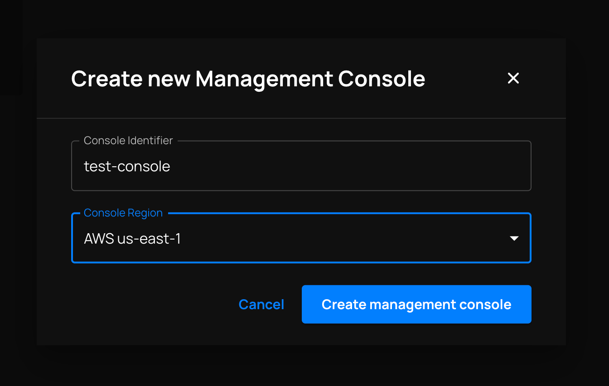
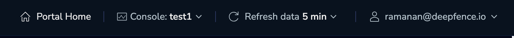

# Deploying ThreatStryker Consoles

Any **admin** user in your Deepfence Cloud organization can deploy a ThreatStryker management console.  Once deployed, any user in the organization can access that console without any additional login steps.

### Task 1 - Deploy a new ThreatStryker Console

1. Log in to the Deepfence Cloud portal.
2. From the home page, select the '**Create new Management Console**' tile.  This will prompt you for the following information:

    Provide an **identifier** and select a **region** where that console should be deployed.

    

:::info
The identifier you provide will be used to construct a DNS name. You'll use that DNS name to refer to your console when you  install ThreatStryker sensor agents.
:::

The request to deploy the console is quickly registered. Deployment can take a few minutes and the console will be marked as **Ready** in Deepfence Cloud once deployment is complete. Any errors during deployment are displayed in Deepfence Cloud, and also sent by email.

### Task 2 - Access a ThreatStryker Console

1. Log in to the Deepfence Cloud portal.
2. From the home page, click on one of the tiles representing existing ThreatStryker consoles.  This action will load the console in your browser.

You can quickly switch between different console instances from your browser, or return **Home** to the list of console tiles using the top bar.
    

### Task 3 - Delete a ThreatStryker Console

1. Log in to the Deepfence Cloud portal.
2. From the home page, locate the tile representing the ThreatStryker console to be deleted.  Click the 'Delete' icon, and enter the console's identifier to confirm the permanent deletion of that console and its data.
