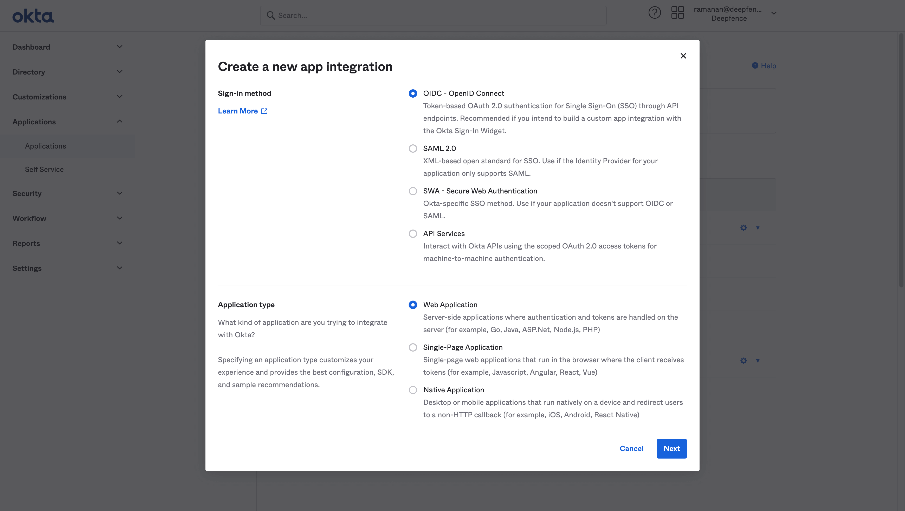
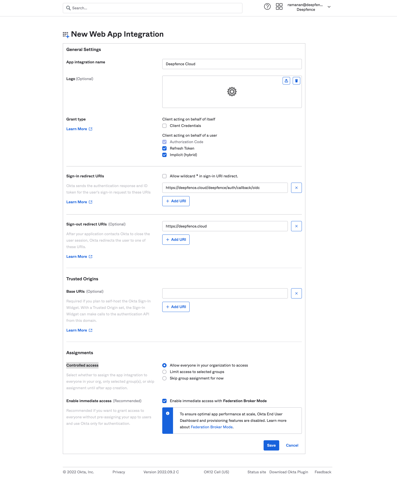
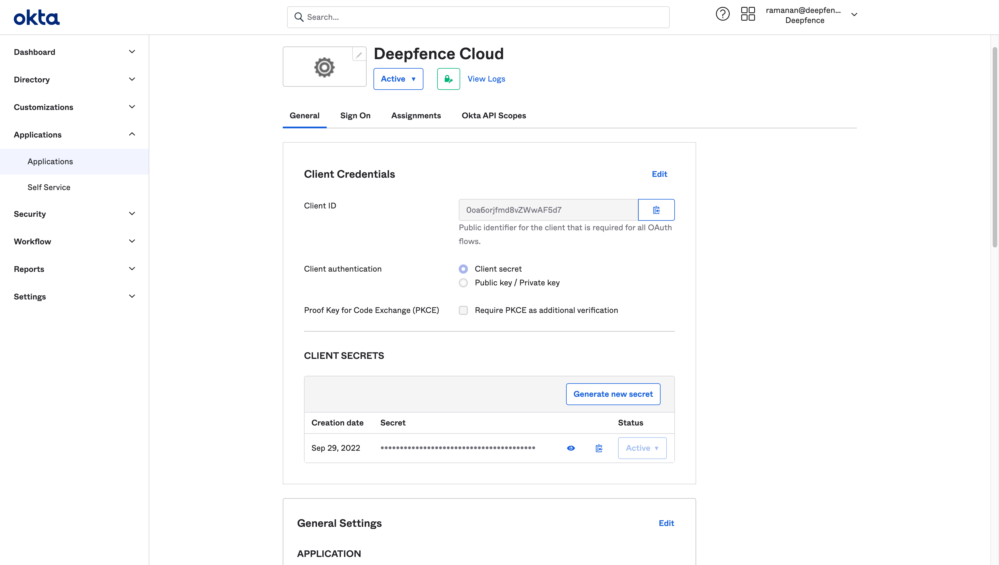
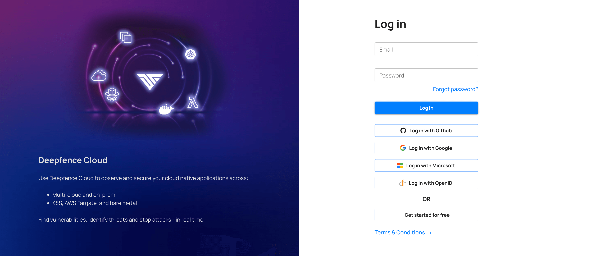
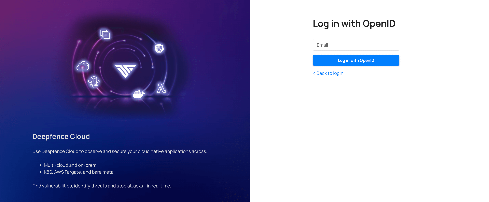

# Single Sign-On

Deepfence Cloud supports single sign-on using Google, GitHub and Microsoft by default.
Additionally, you can configure any OpenID Connect ID provider like Okta.

# Okta - OpenID Connect

To configure Okta as ID provider for Deepfence Cloud, please follow these steps

1. Create new app integration in Okta's admin console

    

2. Choose `OIDC - OpenID Connect` and `Web Application`
3. Select `Refresh Token` and `Implicit (hybrid)`
4. Set `Sign-in redirect URIs` to `https://deepfence.cloud/deepfence/auth/callback/oidc`
5. Set `Sign-out redirect URIs` to `https://deepfence.cloud`

   

6. You can configure `Controlled access` as per the requirements
7. Click `Save`

    

8. Copy the `Client ID` and `Client Secret`. 

# Configure OpenID Connect in Deepfence Cloud

1. Register to Deepfence Cloud using username and password or social login.
2. Click user profile menu on the top right and then click `Organization Settings` and then `SSO Configuration` tab.

    

3. Enter the `Client ID` and `Cliet Secret` from the OpenID Connect provider, in this example, from Okta.
4. `Issuer URL` is the ID provider's URL. Example: `https://organization.okta.com`
5. Optionally you can disable password login and social login (Google, GitHub, Microsoft).
:::info
When password login is disabled, users invited to the platform will continue to provide a password during registration. However, OpenID Connect will be used for authentication.
:::
6. On the login page, click `Login with OpenID` and enter your email id to log in with the configured SSO. 

   