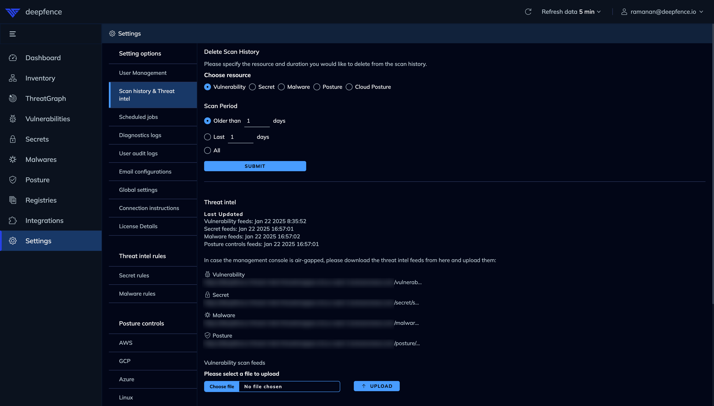

# Deploying Console into Air-Gapped Environments

When deploying management console into an air-gapped environment, you need to ensure that the console has access to the required images.

### Docker Images

You can download the images and upload them into internal docker registry.

```shell
docker pull quay.io/deepfenceio/deepfence_worker:THREATSTRYKER_VERSION
docker pull quay.io/deepfenceio/deepfence_server:THREATSTRYKER_VERSION
docker pull quay.io/deepfenceio/deepfence_ui:THREATSTRYKER_VERSION
docker pull quay.io/deepfenceio/deepfence_file_server:THREATSTRYKER_VERSION
docker pull quay.io/deepfenceio/deepfence_agent:THREATSTRYKER_VERSION
docker pull quay.io/deepfenceio/deepfence_cluster_agent:THREATSTRYKER_VERSION
docker pull quay.io/deepfenceio/deepfence_router:THREATSTRYKER_VERSION
docker pull quay.io/deepfenceio/deepfence_redis:THREATSTRYKER_VERSION
docker pull quay.io/deepfenceio/deepfence_kafka_broker:THREATSTRYKER_VERSION
docker pull quay.io/deepfenceio/deepfence_postgres:THREATSTRYKER_VERSION
docker pull quay.io/deepfenceio/deepfence_neo4j:THREATSTRYKER_VERSION
docker pull quay.io/deepfenceio/deepfence_compliance_scanner:THREATSTRYKER_VERSION
docker pull quay.io/deepfenceio/deepfence_telemetry:THREATSTRYKER_VERSION
```

```shell
export IMAGE_REPOSITORY=127.0.0.1:5000

docker tag quay.io/deepfenceio/deepfence_worker:THREATSTRYKER_VERSION ${IMAGE_REPOSITORY}/deepfence_worker:THREATSTRYKER_VERSION
docker tag quay.io/deepfenceio/deepfence_server:THREATSTRYKER_VERSION ${IMAGE_REPOSITORY}/deepfence_server:THREATSTRYKER_VERSION
docker tag quay.io/deepfenceio/deepfence_ui:THREATSTRYKER_VERSION ${IMAGE_REPOSITORY}/deepfence_ui:THREATSTRYKER_VERSION
docker tag quay.io/deepfenceio/deepfence_file_server:THREATSTRYKER_VERSION ${IMAGE_REPOSITORY}/deepfence_file_server:THREATSTRYKER_VERSION
docker tag quay.io/deepfenceio/deepfence_agent:THREATSTRYKER_VERSION ${IMAGE_REPOSITORY}/deepfence_agent:THREATSTRYKER_VERSION
docker tag quay.io/deepfenceio/deepfence_cluster_agent:THREATSTRYKER_VERSION ${IMAGE_REPOSITORY}/deepfence_cluster_agent:THREATSTRYKER_VERSION
docker tag quay.io/deepfenceio/deepfence_router:THREATSTRYKER_VERSION ${IMAGE_REPOSITORY}/deepfence_router:THREATSTRYKER_VERSION
docker tag quay.io/deepfenceio/deepfence_redis:THREATSTRYKER_VERSION ${IMAGE_REPOSITORY}/deepfence_redis:THREATSTRYKER_VERSION
docker tag quay.io/deepfenceio/deepfence_kafka_broker:THREATSTRYKER_VERSION ${IMAGE_REPOSITORY}/deepfence_kafka_broker:THREATSTRYKER_VERSION
docker tag quay.io/deepfenceio/deepfence_postgres:THREATSTRYKER_VERSION ${IMAGE_REPOSITORY}/deepfence_postgres:THREATSTRYKER_VERSION
docker tag quay.io/deepfenceio/deepfence_neo4j:THREATSTRYKER_VERSION ${IMAGE_REPOSITORY}/deepfence_neo4j:THREATSTRYKER_VERSION
docker tag quay.io/deepfenceio/deepfence_compliance_scanner:THREATSTRYKER_VERSION ${IMAGE_REPOSITORY}/deepfence_compliance_scanner:THREATSTRYKER_VERSION
docker tag quay.io/deepfenceio/deepfence_telemetry:THREATSTRYKER_VERSION ${IMAGE_REPOSITORY}/deepfence_telemetry:THREATSTRYKER_VERSION
docker tag quay.io/deepfenceio/deepfence_agent:fargate-THREATSTRYKER_VERSION ${IMAGE_REPOSITORY}/deepfence_agent:THREATSTRYKER_VERSION
```

```shell
export IMAGE_REPOSITORY=127.0.0.1:5000

docker push ${IMAGE_REPOSITORY}/deepfence_worker:THREATSTRYKER_VERSION
docker push ${IMAGE_REPOSITORY}/deepfence_server:THREATSTRYKER_VERSION
docker push ${IMAGE_REPOSITORY}/deepfence_ui:THREATSTRYKER_VERSION
docker push ${IMAGE_REPOSITORY}/deepfence_file_server:THREATSTRYKER_VERSION
docker push ${IMAGE_REPOSITORY}/deepfence_agent:THREATSTRYKER_VERSION
docker push ${IMAGE_REPOSITORY}/deepfence_cluster_agent:THREATSTRYKER_VERSION
docker push ${IMAGE_REPOSITORY}/deepfence_router:THREATSTRYKER_VERSION
docker push ${IMAGE_REPOSITORY}/deepfence_redis:THREATSTRYKER_VERSION
docker push ${IMAGE_REPOSITORY}/deepfence_kafka_broker:THREATSTRYKER_VERSION
docker push ${IMAGE_REPOSITORY}/deepfence_postgres:THREATSTRYKER_VERSION
docker push ${IMAGE_REPOSITORY}/deepfence_neo4j:THREATSTRYKER_VERSION
docker push ${IMAGE_REPOSITORY}/deepfence_compliance_scanner:THREATSTRYKER_VERSION
docker push ${IMAGE_REPOSITORY}/deepfence_telemetry:THREATSTRYKER_VERSION
```

Now follow the documentation [here](docker) to deploy the console using the internal registry.
```shell
env IMAGE_REPOSITORY=127.0.0.1:5000 docker compose up -d
```

### ThreatIntel database

You can download the latest ThreatIntel database and upload it in `Settings` page.

|  |
|:----------------------------------------------------------------:|
|                   Scan history & Threat Intel                    |