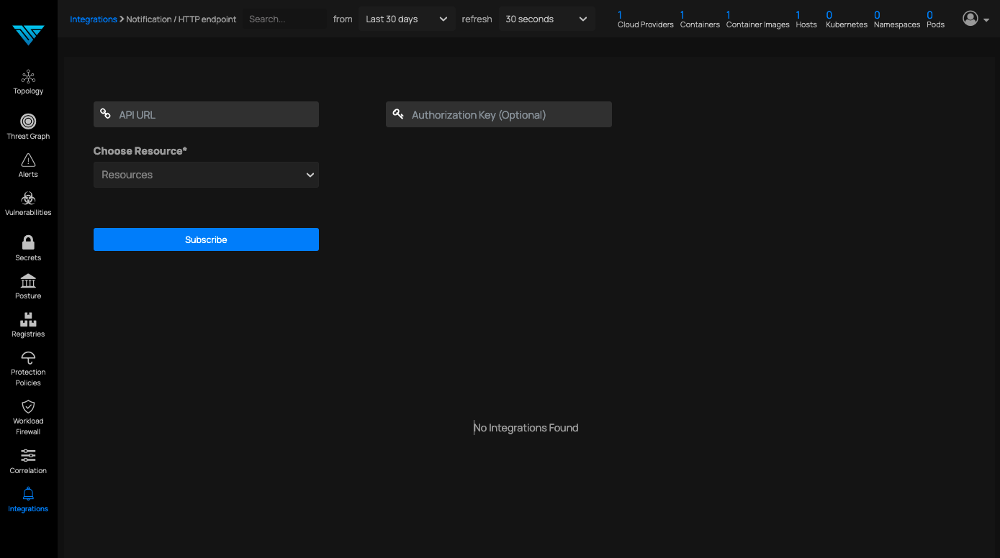

# Http Endpoint

*Forward Notifications to Http EndPoint*

To incorporate this integration the prerequisites are following below

One working API Endpoint 
I.e. These are sample URLs 
https://deepfence.io/route

If any of the API will be called they should be able to read the URL or should be able to read the payload data that has been passed with data parameter

Authentication Token should be enabled so that we could pass token in the header for verification [this feature is must for security concerns]
