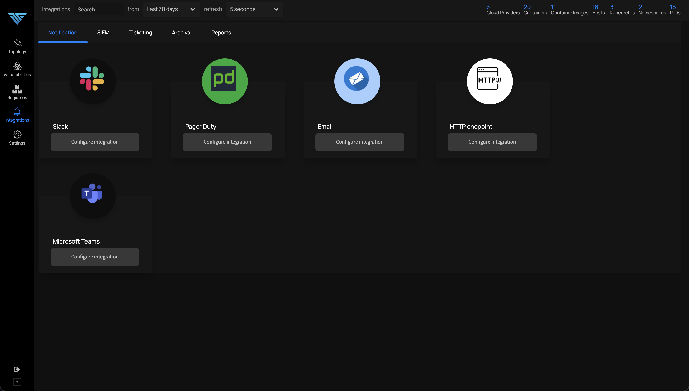

# ThreatStryker Integrations

Deepfence alerts, policy execution logs and scanning reports can be routed to various SIEMs and notifications channels.

Begin on the Integrations screen:



## Detailed Instructions

```mdx-code-block
import DocCardList from '@theme/DocCardList';
import {useCurrentSidebarCategory} from '@docusaurus/theme-common';

<DocCardList items={useCurrentSidebarCategory().items}/>
```

:::info
ThreatStryker and ThreatMapper behave identically with respect to integrations, although ThreatStryker can raise a much broader set of notifications and alerts.
:::
