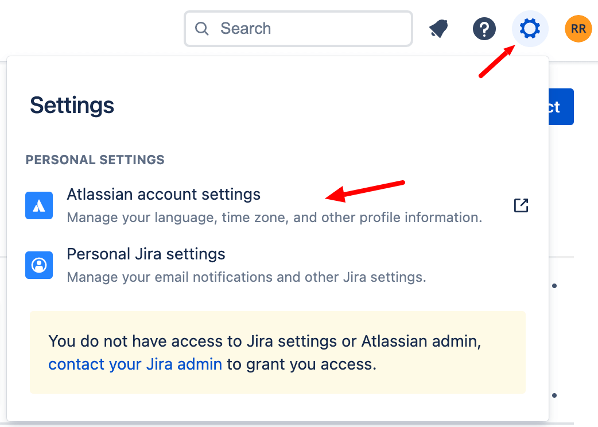
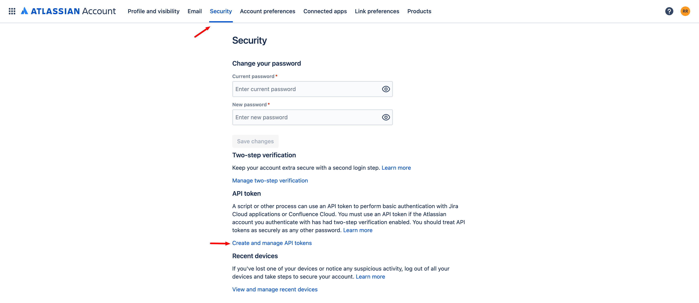
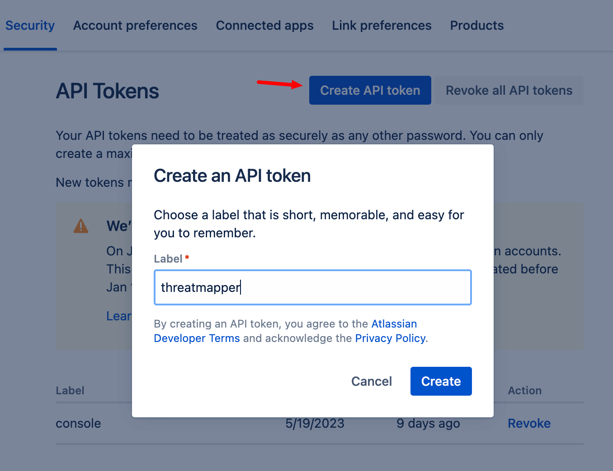
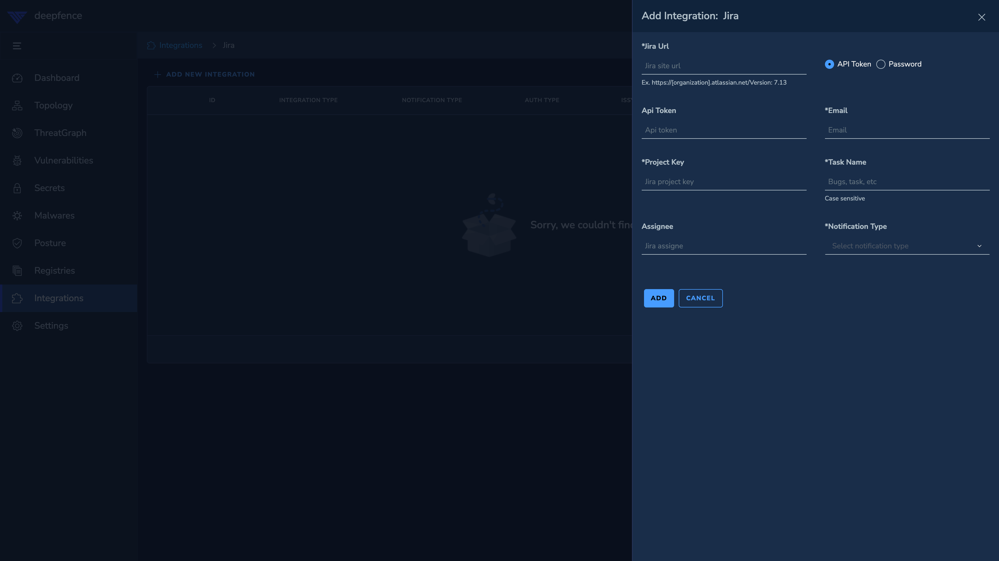

# Jira

ThreatStryker can be configured to raise Jira tickets for vulnerabilities and secrets. The minimum supported version of Jira is 7.13.

## To Configure Jira Integration
For authentication either password of a user account or an api token can be used.

[https://support.atlassian.com/atlassian-account/docs/manage-api-tokens-for-your-atlassian-account/](https://support.atlassian.com/atlassian-account/docs/manage-api-tokens-for-your-atlassian-account/)

To generate an api token:

1. Click settings icon and navigate to **Atlassian account settings**

   

2. Once you navigate there, click **security tab**:

   

3. Click **Create API Token** button, set label and create:

   

4. On the ThreatStryker Jira integrations page enter the jira site url, username, api token. 
   The JIRA project key is the prefix of the issue numbers , e.g. issue "JRA-123" has "JRA" as project key
   Enter the type of ticket you would want ThreatStryker to create (Task / Bug etc.):
   
