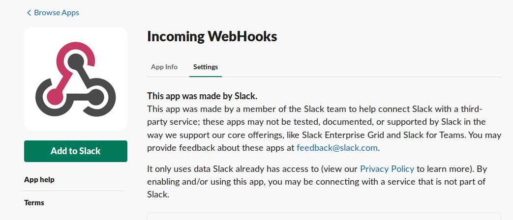

# Slack

*Forward Notifications to Slack Channels*

Navigate to `https://[Your Workspace].slack.com/apps` and search for the "Incoming Webhooks" app from Slack.

Click on "Add to Slack", where you will be asked to choose a channel

Follow the "Setup Instructions":

Paste the webhook URL and the corresponding channel name into Deepfence Slack integration page.
