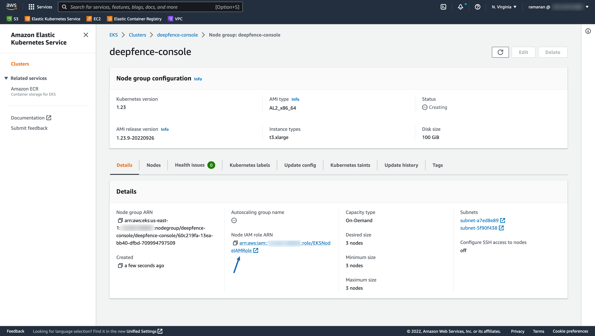
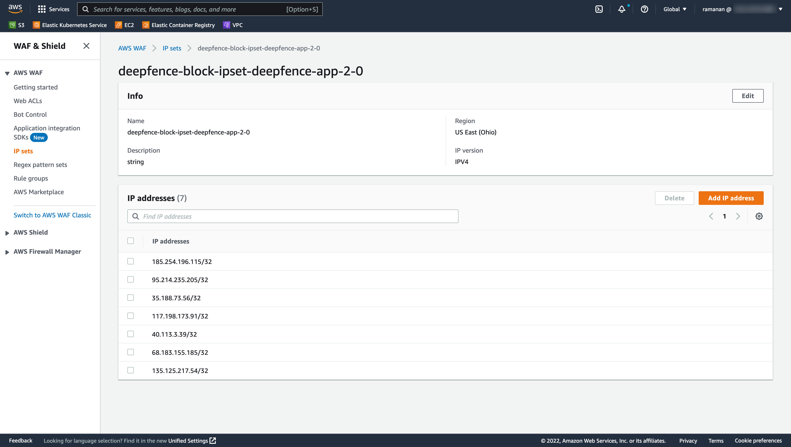
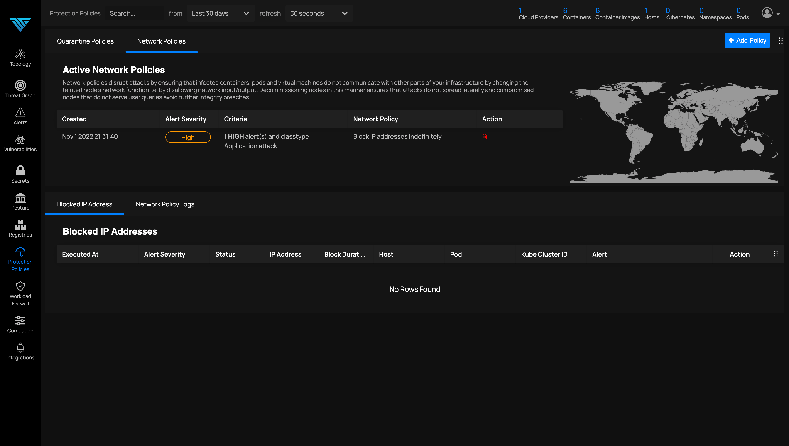

# Multi-Stage Attack Disruption

*MultiStage, Wide-Area Attack Disruption*

ThreatStryker helps you detect multiple stages of an attack and provides protection policies to disrupt those attacks at various stages.

## Quarantine Policies

Quarantine policies enable reset, pause and decommissioning of infected containers, pods or virtual machines:

## Network Policies

Network policies enable blocking external as well as internal attackers on their tracks. Protection Policy can be enforced using deepfence agent or [Cloud WAF](#network-protection-policy-using-cloud-waf). By default, it is enforced by deepfence agent.

## Alert Correlation with Clustering Rules

User can define rules to cluster similar alerts based on their classtypes, frequency and spatial attributes. This helps to reduce potential noise, and view the alerts in a grouped manner.

## Intent Detection Rules

Intent detection rules empower users to perform advanced correlation on alerts based on various alert attributes like classtypes, intents, presence of known vulnerabilities and other spatial attributes as follows:

## Network Protection Policy using Cloud WAF

Protection policy can be enforced using Cloud WAF if configured by the user. Only AWS WAF is supported at this moment.
Deepfence will create [IP Set](https://docs.aws.amazon.com/waf/latest/developerguide/waf-ip-set-creating.html) and add a [rule](https://docs.aws.amazon.com/waf/latest/developerguide/waf-rule-statement-type-ipset-match.html) in the Web ACL's provided by the user.

:::note
This feature is available from v3.7.1
:::

### IAM role

1. Deepfence Management Console requires write permissions to WAF for policy enforcement. 
2. If console is deployed in a EC2 vm, add the policy `AWSWAFFullAccess` to the instance IAM role.
   
3. In case of EKS (Kubernetes), this policy (`AWSWAFFullAccess`) should be added to `Node IAM role` of the node group.
   

### Configuration
1. Copy ARN's of all Web ACL's in all regions that needs protection.
   
2. Add the Web ACL ARN's in Deepfence settings and save.
   
3. Deepfence will automatically create IP Set for each Web ACL provided and update those Web ACL's with new rule.
   
   

### Set policy
1. Set network protection policies based on intents/classtypes. Alerts matching the policies will result in source ip getting added to the IP Set managed by Deepfence and blocked.
   
2. Setting a blacklist node network policy will add the ip address to the WAF IP sets for blocking.
   