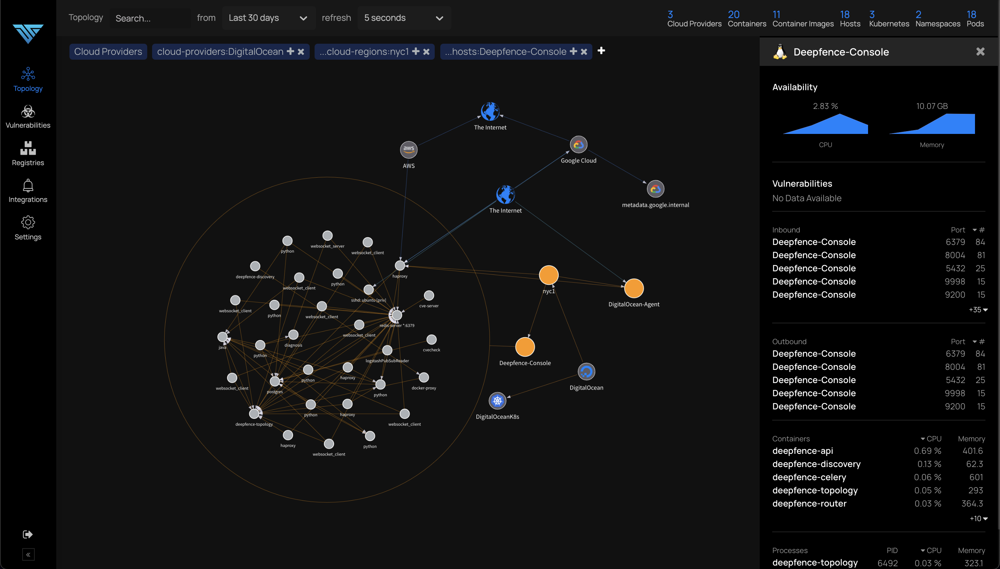

# Visualization

*See all from a single point of control*

You can visualize the entire topology of your running VMs, hosts, containers etc. from the topology tab. You can click on individual nodes to initiate various tasks like vulnerability or secret scanning.

