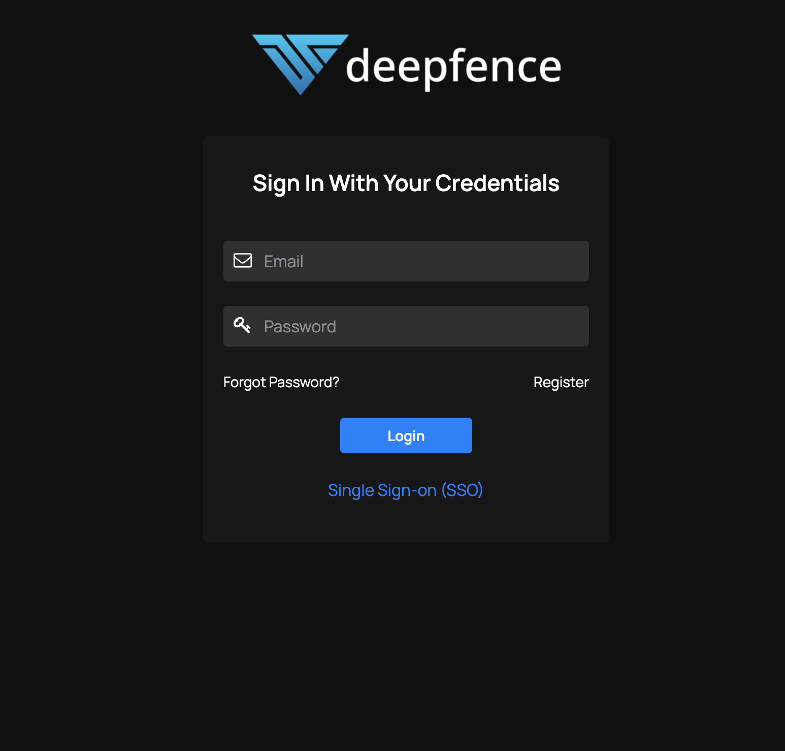
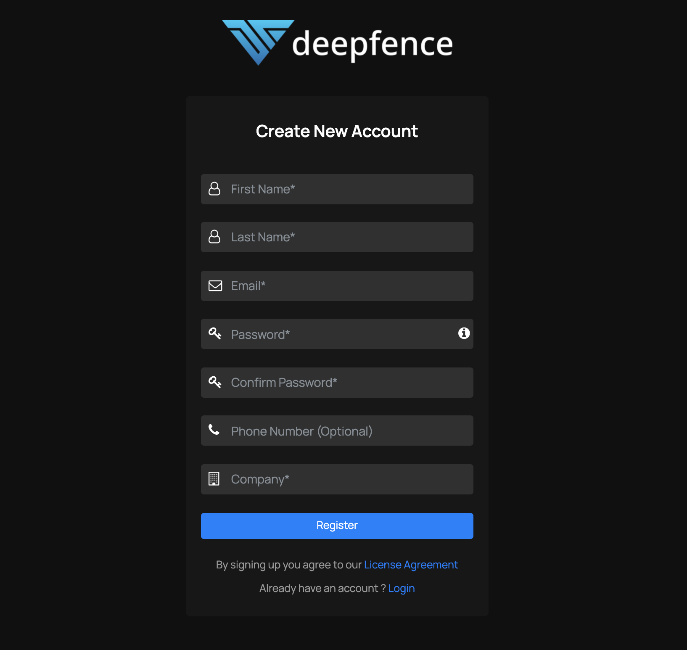
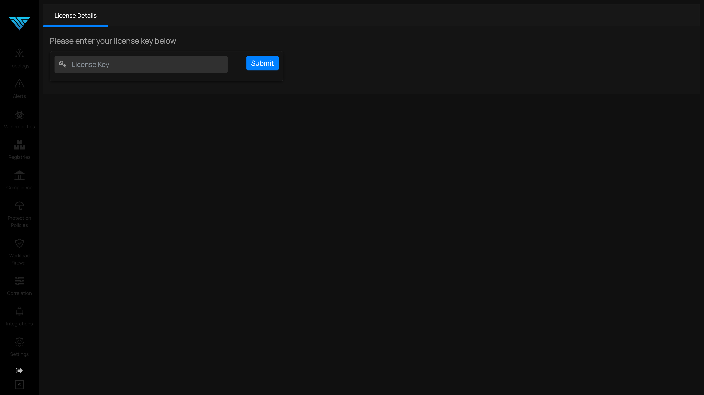
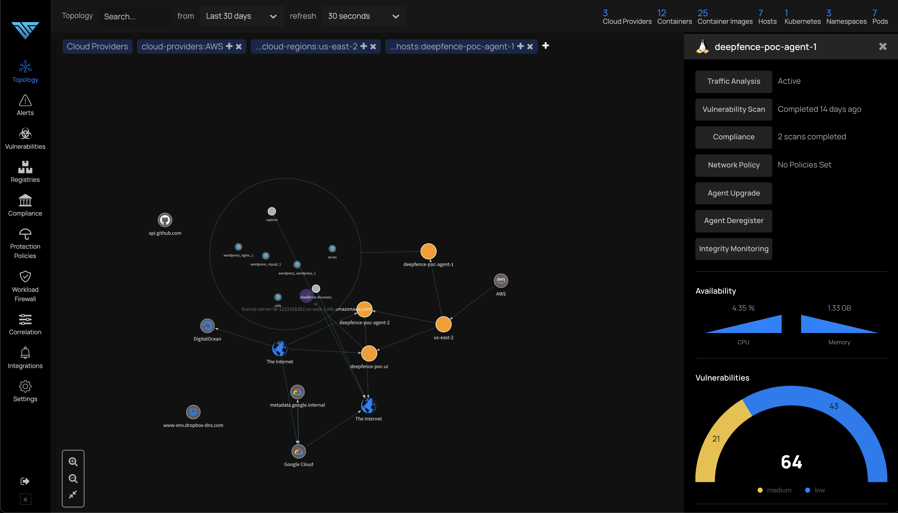

# Managing Users

Once you have deployed the ThreatStryker Management Console, you can then allocate user accounts to that console.

After the successful completion of docker or kubernetes deployment, if the IP address of the VM or host that has the Deepfence management console is 192.168.1.10, please navigate to http://192.168.1.10, and click on the **Register** link as shown in the image below.

Complete all the necessary details as shown in the image below.

Enter license key obtained in the email to activate the account

After successful activation of the account, a visual depiction of the hosts, containers & pods where deepfence agents are deployed are shown, as in the image below.

