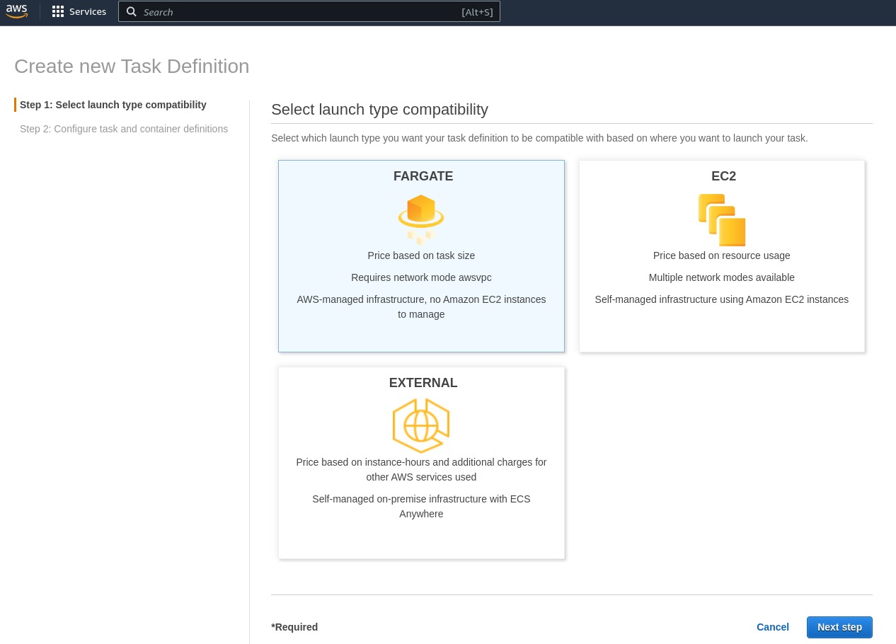
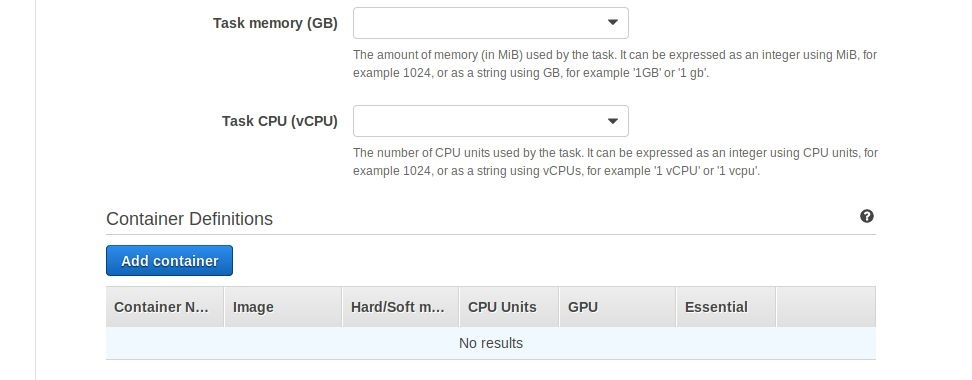
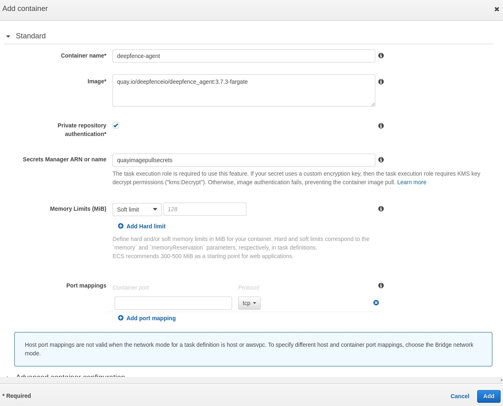
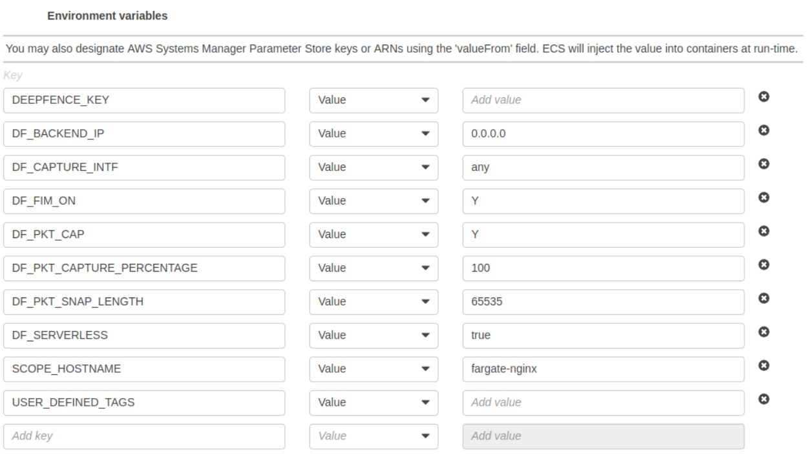
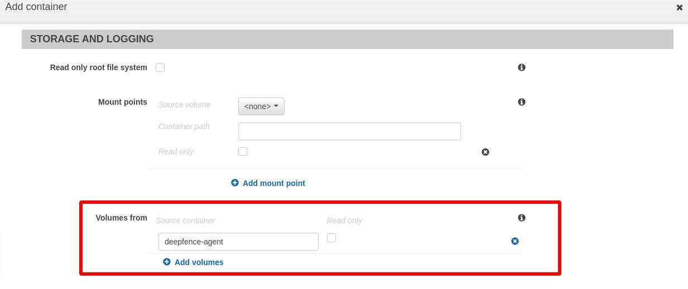
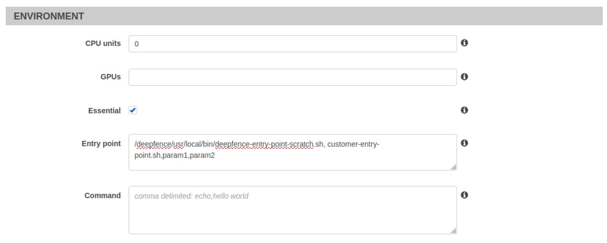
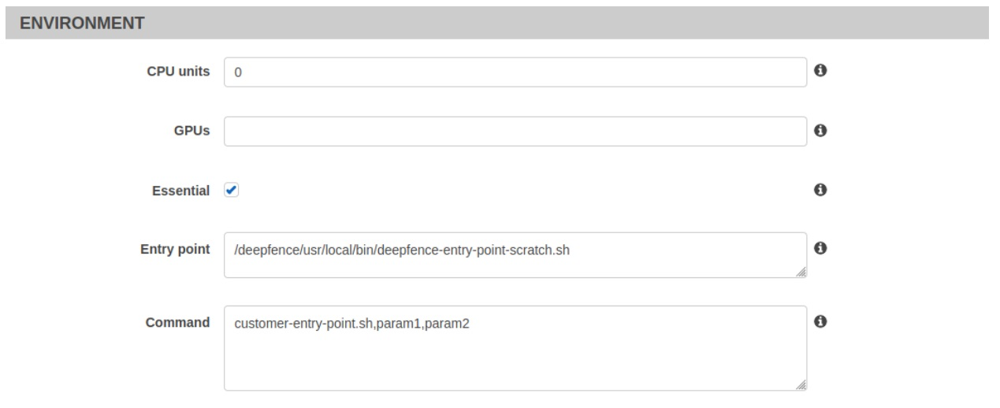
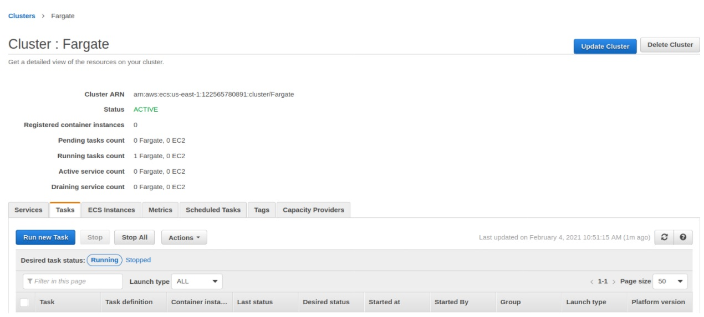
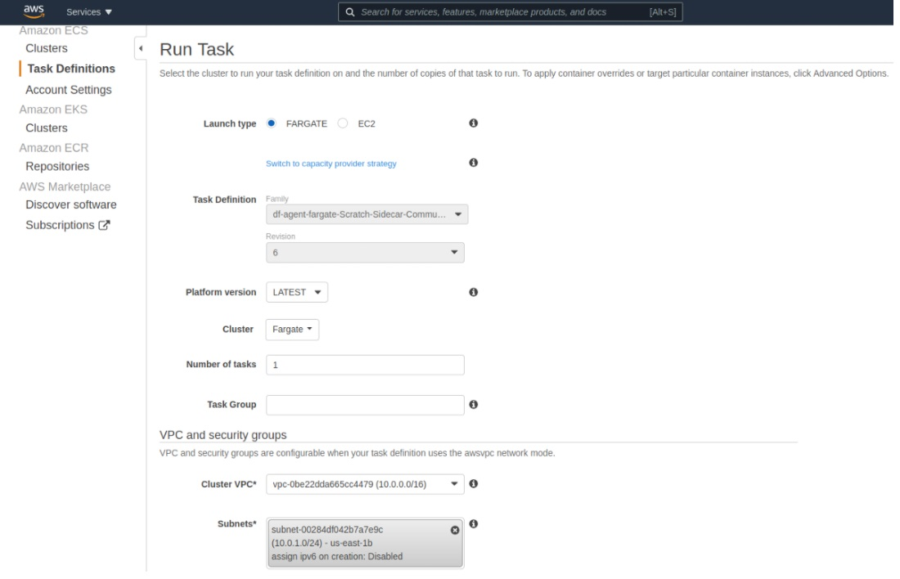

# AWS Fargate

*Deployed as a sidecar container using a task definition*

In AWS Fargate, the ThreatStryker agents are deployed as a sidecar container using a task definition. 

The ThreatStryker management console is installed separately outside the fargate and the installation procedure is the same as before.


# Installing on AWS Fargate


1. Set up AWS ECS by following the steps outlined here: [Set up to use AWS ECS](https://docs.aws.amazon.com/AmazonECS/latest/developerguide/get-set-up-for-amazon-ecs.html)

2. Add the Deepfence Quay secrets provided to AWS secrets manager by following the steps outlined here: [Introducing private registry authentication support for AWS Fargate](https://aws.amazon.com/blogs/compute/introducing-private-registry-authentication-support-for-aws-fargate) and here: [Private registry authentication for tasks](https://docs.aws.amazon.com/AmazonECS/latest/developerguide/private-auth.html)

    You'll need to perform the following steps:

    1. Create an *AWS ECS task execution IAM role*. 
    1. Create a secret so that fargate can pull the Deepfence agents from Quay using the username/password provided
    in the license email. Note the created secret name or ARN (you will need to enter them in *task definition creation* step later). You may need to create other secrets to access your own artifacts. 
    1. Create policies (either managed or inlined policy) allowing access to your stored secrets and attach the created policies to the task IAM role. You also need to attach the *AmazonECSTaskExecutionRolePolicy* to the IAM role to run AWS ECS tasks.

3. On the AWS ECS home webpage, click on the task definition on the side panel to create a new task definition. Select fargate as launch type and then go to Next step.  

    Use the following steps outlined below in  **"Fargate Task definition And Deployment"** instructions to deploy the fargate agent. 

    You can configure the task definition either through Json or using the AWS UI.

4. Deploy your application on your cluster.

## Create New Task Definition in Fargate


### Create Task Definition

Click Create new Task Definition and select fargate as launch type and then go to *Next step*.

|  |
| :--: |
| *New Fargate Task *|

### Set Task Parameters

Edit the *Task Definition Name*, *Task Role* and *Task Execution Role etc*. as required. For the *Task Role* and *Task Execution Role*, you have to use the role created in *IAM role creation step* earlier. Specify *Task memory* and *Task CPU* according to your Requirements.

|  |
| :--: |
| *Update task definition and create agent container* |


### Add the Container

Click on the *Add Container* button to create a standard container for the ThreatStryker agent. Set image as _**quay.io/deepfenceio/deepfence_agent:3.7.3-fargate**_ 

**Check** the private repository authentication and add the secret name or ARN from *IAM role creation step* to access Deepfence Quay. In the environment section, **DO NOT** mark it as essential.

You need to note down the name of the agent container (*deepfence-agent* in our example), which you will have to specify in *Volumes From* section in application container task definition section later. 

Finally, click the *Add* button to create the deepfence agent container:

|  |
| :--: |
| *Create the Agent Container inside the Task Definition* |


### Add the Container to your Application

Click on the *Add Container* button to create a new container for your application by following the additional steps outlined below. If you have more than one application container, you will have to repeat these steps for each container.


#### Configure Environment Variables for Fargate Application Container

The following environment variables are required for the ThreatStryker agent:

 * **DEEPFENCE_KEY**: API key available in the management console UI
 * **MGMT_CONSOLE_URL**: IP address of Management Console
 * **DF_SERVERLESS**: Set to *true* for serverless instances

<!-- |  |
| :--: |
| *Configuring Environment Variables for Fargate Application Container* | -->

 
If you are using json to configure your task definitions, you can use the following part in the appropriate container section of task definition json after copying the appropriate IP address and API Key.

```
"environment": [
    {
        "name": "DEEPFENCE_KEY",
        "value": "<deepfence-key>"
    }
    {
        "name": "MGMT_CONSOLE_URL",
        "value": "<MGMT_CONSOLE_URL>"
    },
    {
        "name": "DF_SERVERLESS",
        "value": "true"
    },
    {
        "name": "DF_FIM_ON",
        "value": "N"
    },
    {
        "name": "DF_TRAFFIC_ANALYSIS_MODE",
        "value": "all"
    },
    {
        "name": "DEFENDERD_DISABLE_XFF_PROTECTION",
        "value": "false"
    },
    {
        "name": "DEFENDERD_TCP_BUFFER_LIMIT",
        "value": "500MB"
    },
    {
        "name": "DF_TRAFFIC_ANALYSIS_ON",
        "value": "Y"
    },
    {
        "name": "USER_DEFINED_TAGS",
        "value": ""
    }
]
```

#### Configure Storage 

In the application container, update storage to allow read/write from deepfence agent volume by specifying the agent container name in *volumes from*. Leave the *Read only* button **unchecked** as shown below.

|  |
| :--: |
| *Configure VolumesFrom Setting* |

If you are using json to configure your task definitions, you can copy the following settings to the appropriate container section of the json after changing the Container name:

```
"volumesFrom": [
   {
       "sourceContainer": "deepfence-agent",
       "readOnly": false
   }
],
```

Finally, click the Create button to create the task definition for the deployment.

### Configure Correct Startup

Now that deepfence agent is available in the fargate instance, you need to invoke agent and application entrypoints to start the application with Deepfence enabled. This can be done in two ways:

#### Option 1: Change Application Container Image

The first option requires that you can change the application container image. Before building your application containers for deployment, add a call to start Deepfence *entrypoint* at the beginning of application *entrypoint*  (or at any point before starting your application) as shown in the following example script. 

Note that the fargate instance will stop if any of the essential containers exit, so the user application container has to be written accordingly.

```bash
#!/bin/bash -x

echo "Start Deepfence services... Console is $MGMT_CONSOLE_URL"
/deepfence/usr/local/bin/deepfence-entry-point-scratch.sh

############################################################
# Start the customer application entry point below...
############################################################

echo "Starting the customer application entry point below..."
#cust-entry-point.sh "$@"

echo "Block to avoid customer application container from exiting fargate."
/deepfence/usr/local/bin/block-scratch.sh
echo "customer entry-point is exiting...."
```


#### Option 2: Edit the Entry Point for the container

The second option does not require any change in the application container. You can run the same image seamlessly on a VM, EC2 instance, or a fargate instance. There are two ways to achieve this:

**Change the Entrypoint**: For this, you need to provide the ThreatStryker entrypoint and the Application entrypoint and arguments, as a comma delimited list in the **Entry point** field:

|  |
| :--: |
| *Method (2a): Invoking agent by changing the Entrypoint* |


If you are using json to configure your task definitions, then you can specify the entrypoint and/or command as follows using appropriate quoting:

```
"entryPoint": [
   "/deepfence/usr/local/bin/deepfence-entry-point-scratch.sh",
   "customer-entry-point.sh",
   "param1",
   "param2"
]
```

**Change the Entrypoint and Command**: Alternatively, you can provide the ThreatStryker entrypoint in the **Entry point** field and the Application entrypoint and arguments in the **Command** field as shown below:

|  |
| :--: |
| *Method (2b): Invoking agent by changing the Entrypoint and Command field* |


If you are using json to configure your task definitions, then you can specify the entrypoint and/or command as follows using appropriate quoting:

```
"entryPoint": [
   "/deepfence/usr/local/bin/deepfence-entry-point-scratch.sh"
],
"command": [
   "customer-entry-point.sh",
   "param1",
   "param2"
]
```


## Deploy ThreatStryker Agent Service on Fargate

After creating your updated application containers and the task definitions, you can launch your fargate instance in your cluster. 

You can launch your fargate instance by clicking *Run task* in the actions dropdown of the task definition. Otherwise, you can click “Run New Task” button in “Tasks” tab of your cluster:

|  |
| :--: |
| *Deploying fargate instance on your cluster* |


Select *Fargate* as the launch type and choose appropriate task definition, cluster, number of tasks, VPC and security groups before launching the task. Fargate agents should be able to access ports 8000–8010 on console, so users need to make sure that security groups allow these outbound connections and other connections as needed.

|  |
| :--: |
| *Run the fargate task on your cluster* |


Finally, click the “Run Task” button.
