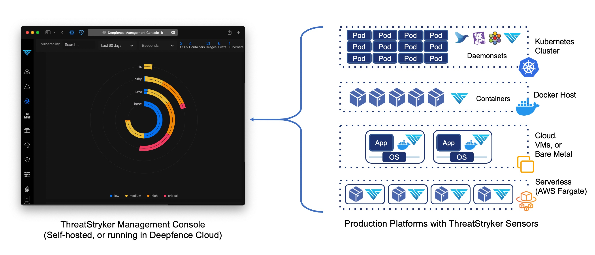

# ThreatStryker Components

## ThreatStryker Management Console

The ThreatStryker Management Console ("Console") is a standalone application and API endpoint for your ThreatStryker-secured platform. 

The console allows you to:

* Visualize and drill down into Kubernetes clusters, virtual machines, containers and images, running processes, and network connections in near real time.
* Invoke vulnerability and secret scans on running containers, applications and hosts and review the results, ranked by risk-of-exploit.
* Invoke compliance scans using a variety of benchmarks against containers, kubernetes and cloud infrastructure and hosts
* Configure telemetry gathering to capture network 'indicators of attack' and on-workload 'indicators of compromise'
* Classify telemetry using MITRE ATT&CK attack-based TTPs, and interrogate the telemetry for diagnostic and forensic purposes
* Observe the evolution of attacks against workloads, alerting when they pass a pre-defined threshold of risk
* Configure remedial action - quarantine workloads, firewall internal and external sources of attack - to be deployed automatically
* Set up a variety of integrations against external notification, SIEM and ticketing systems, including Slack, PagerDuty, Jira, Splunk, ELK, Sumo Logic, and Amazon S3.

You may deploy multiple fully-managed instances on the Deepfence Cloud, or standalone (self-hosted) instances in your own infrastructure.

## ThreatStryker Sensors

ThreatStryker Sensors are deployed on your production platforms. They communicate securely with your ThreatStryker Management Console, taking instructions to retrieve SBOMs and run scans, capture and forward telemetry data, and deploy targeted remedial actions against attacks.

The sensors support the following production platforms:

* Kubernetes: The sensors are deployed as a daemonset, similar to other kubernetes services.
* Docker: The sensor is deployed as a docker container on each docker host.
* Bare metal and VM-based platforms: Sensors are deployed as a Docker container on each Linux operating system instance, using a Docker runtime. Linux instances are supported; Windows Server is not * supported, although an experimental implementation is available.
* AWS Fargate The sensor is deployed as a daemon service alongside each serverless instance.

When you deploy a sensor, you configure the destination (address of the ThreatStryker console) and API key to authenticate sensor traffic.