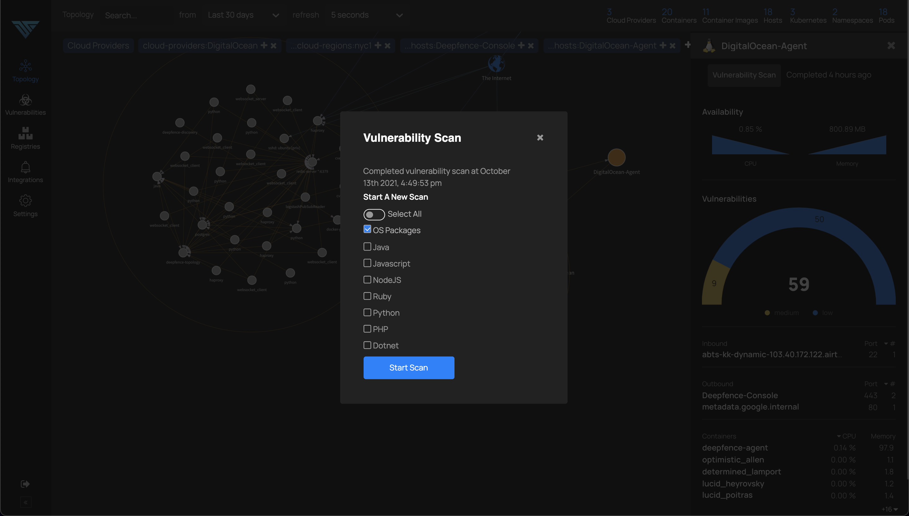
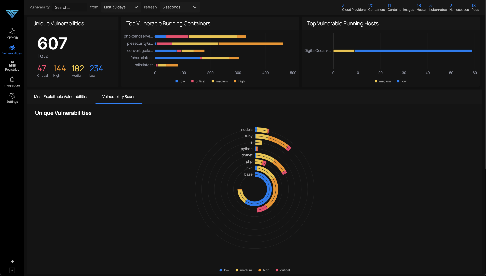
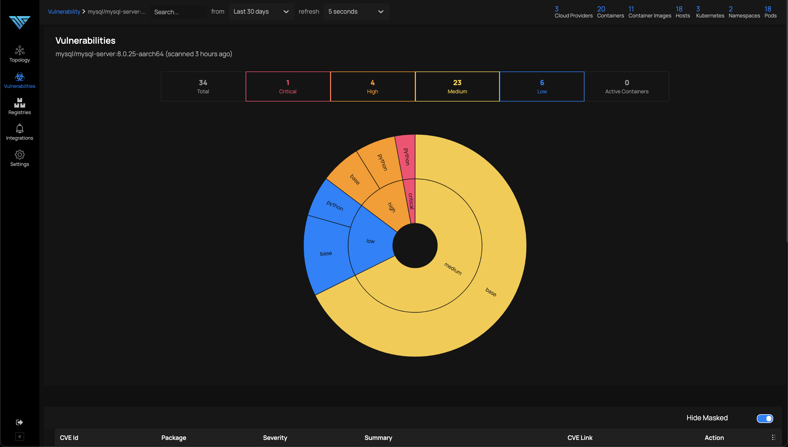
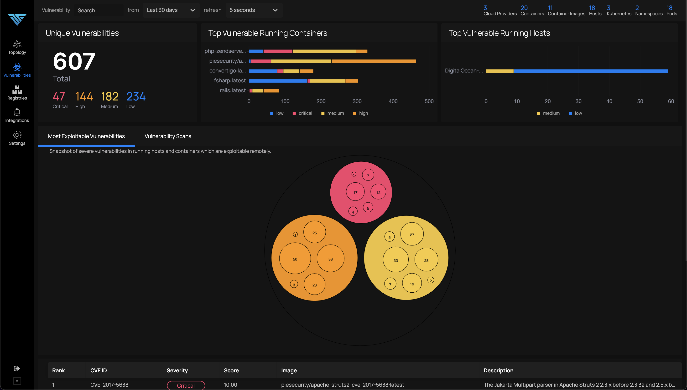

# Runtime Vulnerability Management

*Find vulnerabilities present in running workloads*

From the topology view, runtime vulnerability scanning for running containers & hosts can be initiated using the console dashboard, or by using the APIs. Here is snapshot of runtime vulnerability scan on a host node.

The vulnerabilities and security advisories for each node, can be viewed by navigating to Vulnerabilities menu as follows:

Clicking on an item in the above image gives a detailed view as in the image below:

Most Exploitable Vulnerabilities tab gives a ranked list of vulnerabilities across images to be fixed at priority. Rank is calculated using various parameters like whether the image is running or not, cve score and severity of the vulnerability.

Optionally, users can tag a subset of nodes using user defined tags and scan a subset of nodes, as described in the ThreatStryker documentation (**TODO** - link)
