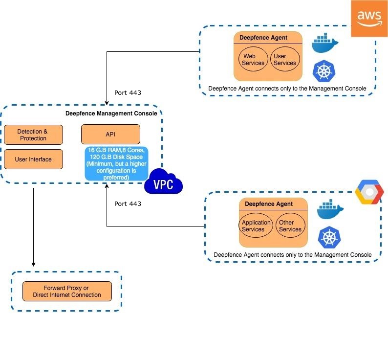

# Deploying with Self-Managed

Deployment Architecture
=======================

A ThreatStryker deployment consists of two components, the ThreatStryker console, and the ThreatStryker sensor agent. The ThreatStryker console is the management plane and ThreatStryker sensor agents are
deployed on the production infrastructure. The machine assigned to run the ThreatStryker console needs to have **port 443** open, so that the ThreatStryker agents can share the runtime telemetry with the console. 

You should control access to the Deepfence Management Console, so that it is only accessible on port 443 from those systems that have installed the Deepfence agent, and from the systems that require access to the Console GUI and API.

If you encounter any security-related issues with ThreatStryker, please [reach out to us](https://github.com/deepfence/ThreatStryker/blob/master/SECURITY.md).

