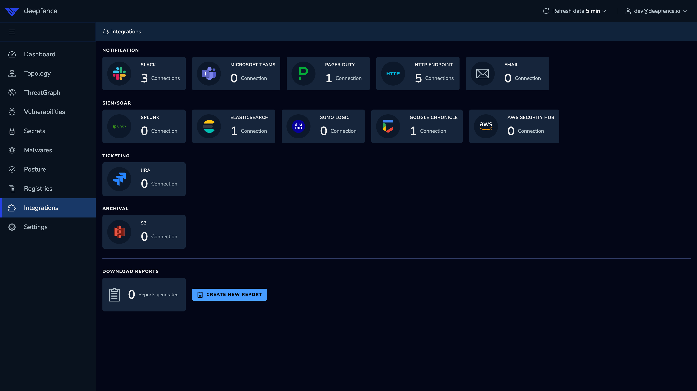
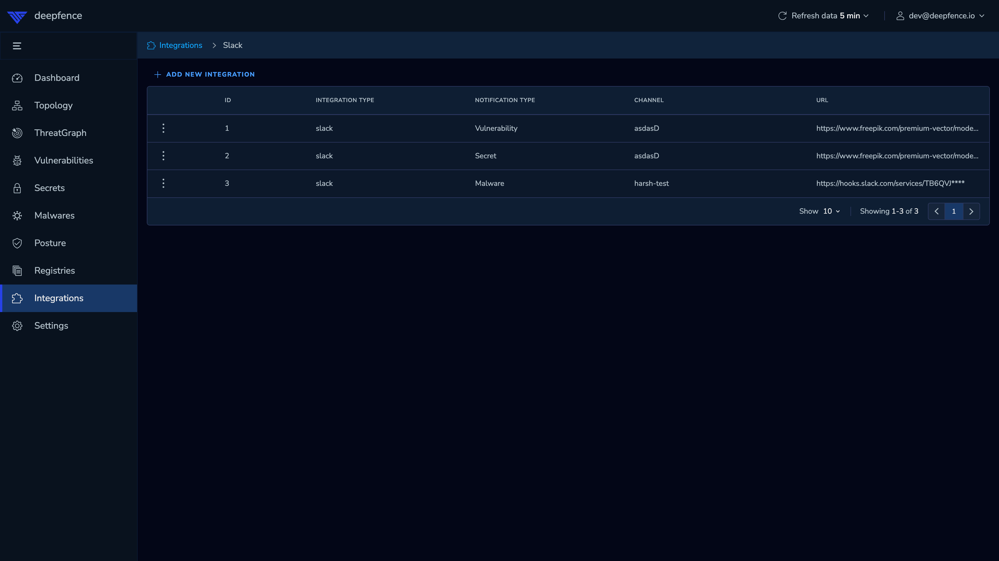

# Integrations

You can integrate ThreatStryker with a variety of notification services.  Any time a new vulnerability is detected (for example, during [CI](/docs/v2.0/operations/scanning-ci) or an [automated scan](/docs/v2.0/operations/scanning)), ThreatStryker will submit the details to the configured notification services.

|         |
|:-----------------------------------------------:|
| Example Integrations supported by ThreatStryker |

## Configuring Notification Services

Configure the notification services you require in the ThreatStryker console:


|  |
|:------------------------------------------------------:|
|             Integrations - Slack (example)             |


The following notification services are among those supported by ThreatStryker:   

```mdx-code-block
import DocCardList from '@theme/DocCardList';
import {useCurrentSidebarCategory} from '@docusaurus/theme-common';

<DocCardList items={useCurrentSidebarCategory().items}/>
```

Check out the **Integrations** pages in the Management Console for a full list.


