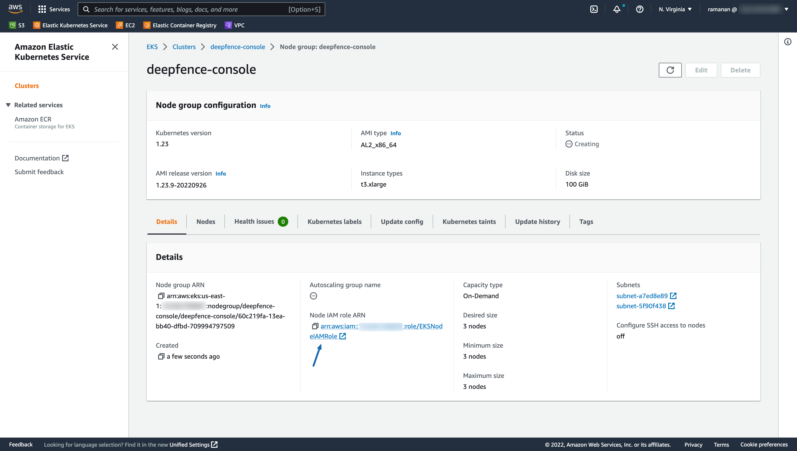

# Multi-Stage Attack Disruption

*MultiStage, Wide-Area Attack Disruption*

ThreatStryker helps you detect multiple stages of an attack and provides protection policies to disrupt those attacks at various stages.

## Quarantine Policies

Quarantine policies enable reset, pause and decommissioning of infected containers, pods or virtual machines:

## Network Policies

Network policies enable blocking external as well as internal attackers on their tracks. Protection Policy can be enforced using deepfence agent or [Cloud WAF](#network-protection-policy-using-cloud-waf). By default, it is enforced by deepfence agent.

## Network Protection Policy using Cloud WAF

Protection policy can be enforced using Cloud WAF if configured by the user. Only AWS WAF is supported at this moment.
Deepfence will create [IP Set](https://docs.aws.amazon.com/waf/latest/developerguide/waf-ip-set-creating.html) and add a [rule](https://docs.aws.amazon.com/waf/latest/developerguide/waf-rule-statement-type-ipset-match.html) in the Web ACL's provided by the user.

### IAM role

1. Deepfence Management Console requires write permissions to WAF for policy enforcement. 
2. If console is deployed in a EC2 vm, add the policy `AWSWAFFullAccess` to the instance IAM role.
   
3. In case of EKS (Kubernetes), this policy (`AWSWAFFullAccess`) should be added to `Node IAM role` of the node group.
   

### Configuration
1. Copy ARN's of all Web ACL's in all regions that needs protection.
   
2. Add the Web ACL ARN's in Deepfence settings and save.
   
3. Deepfence will automatically create IP Set for each Web ACL provided and update those Web ACL's with new rule.
   
   
