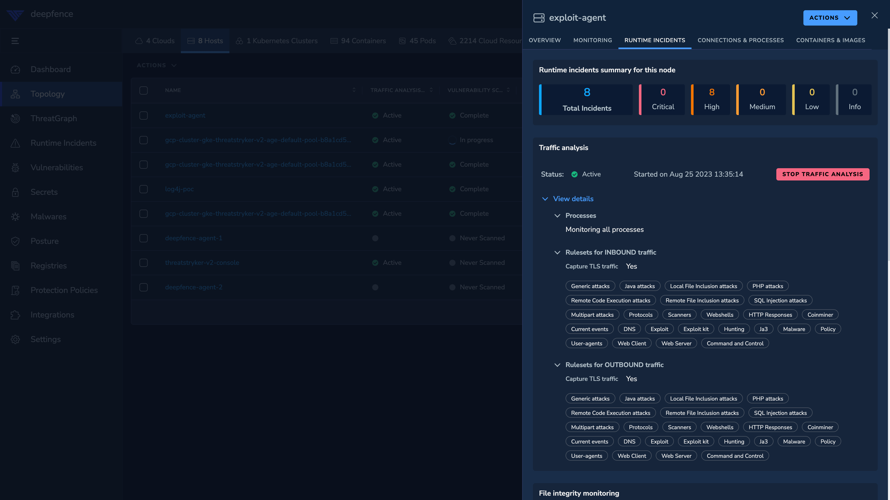

# East-West Deep Packet Inspection

*Inspect Internal Application Traffic*

In addition to workloads specific firewalling and segmentation, ThreatStryker can also perform Deep-Packet Inspection, capturing both east-west and north-south traffic. ThreatStryker's DPI operates in a passive manner, without adding any latency to data path. The
DPI engine can be tuned to based on your performance and security requirements.

