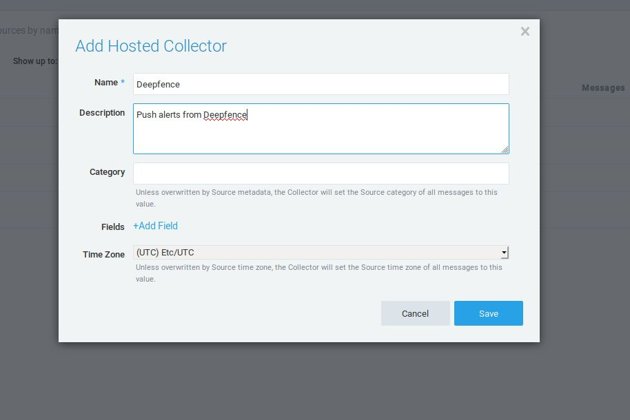

# Sumo-Logic

*Collect Events and Activity Logs*

You can forward ThreatStryker Events and ThreatStryker Activity Logs to Sumo Logic.

## ThreatStryker Events

Under "Manage data", navigate to "Collection"

Click on "Add Collector" and select "Hosted Collector"

Fill in the details and save the new collector

Choose to add "Source" to the newly created collector and choose "HTTP Logs & Metrics"

Fill in the Source details and click save

Copy the resulting URL from the Deepfence Sumo Logic integration page

Enter this into the "HTTP Endpoint" parameter in the ThreatStryker configuration for the Sumo Logic SIEM Integration.

## ThreatStryker User Activity Logs

User activity logs or user audit logs can be exported to Sumo Logic integration.

Follow the steps to add the Sumo Logic Integration in Deepfence and select the option "User Activities" in alert type. Choose the duration from the drop down and click on "Subscribe".

