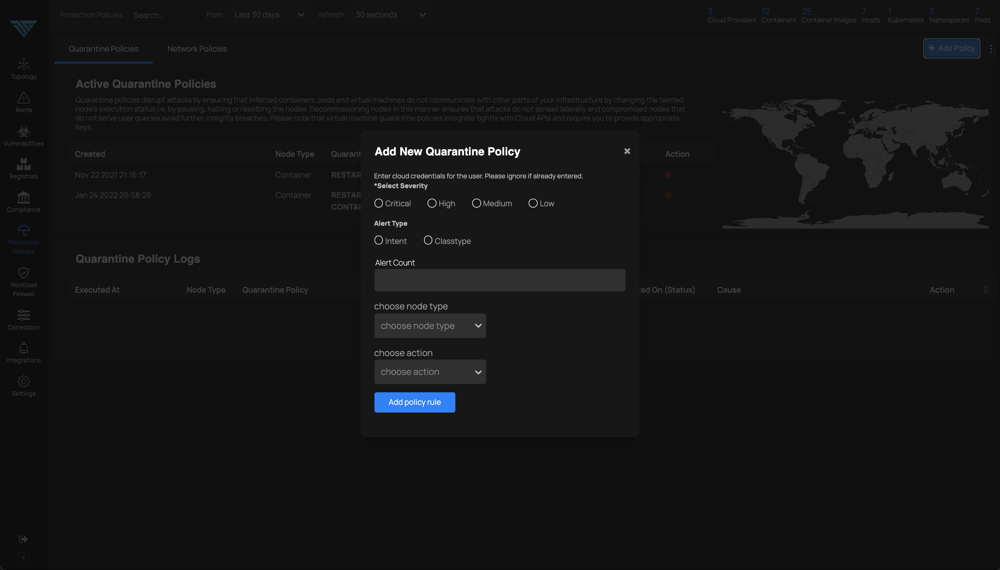
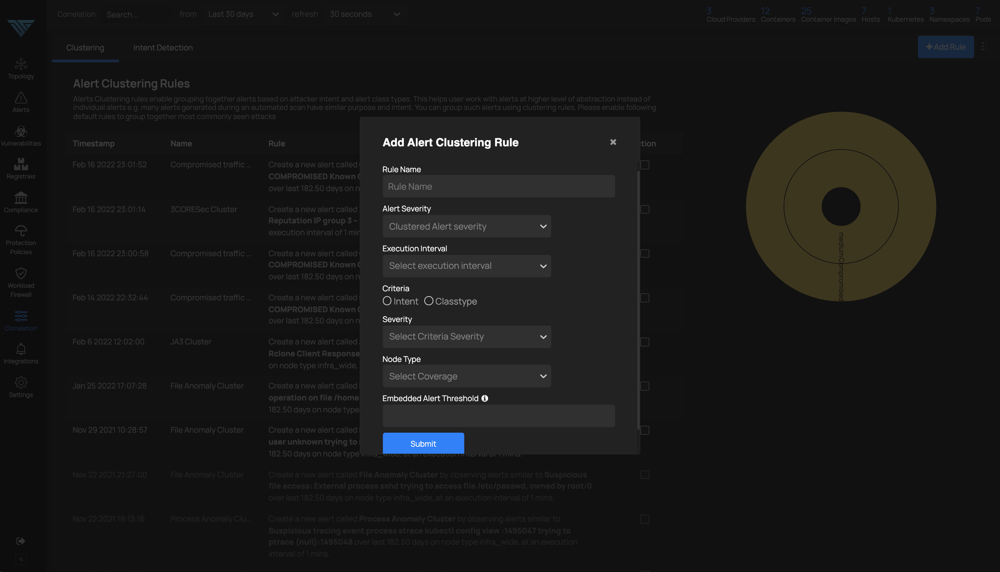

# Multi-Stage Attack Disruption

*MultiStage, Wide-Area Attack Disruption*

ThreatStryker helps you detect multiple stages of an attack and provides protection policies to disrupt those attacks at various stages.

## Quarantine Policies

Quarantine policies enable reset, pause and decommissioning of infected containers, pods or virtual machines:

## Network Policies

Network policies enable blocking external as well as internal attackers on their tracks.

## Alert Correlation with Clustering Rules

User can define rules to cluster similar alerts based on their classtypes, frequency and spatial attributes. This helps to reduce potential noise, and view the alerts in a grouped manner.

## Intent Detection Rules

Intent detection rules empower users to perform advanced correlation on alerts based on various alert attributes like classtypes, intents, presence of known vulnerabilities and other spatial attributes as follows:

