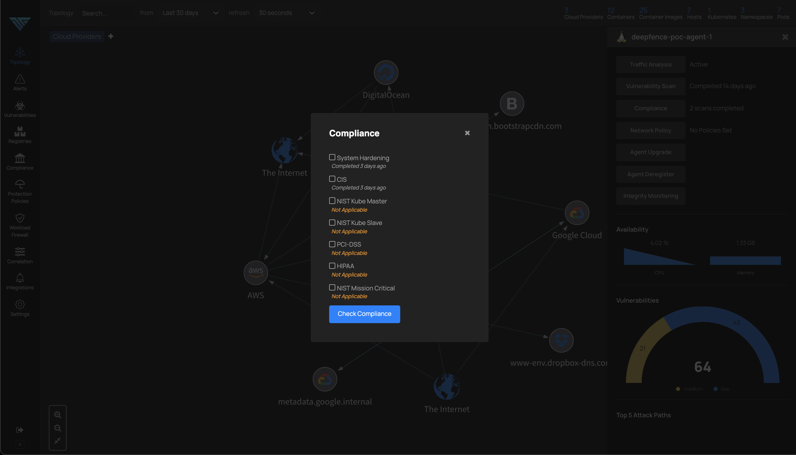
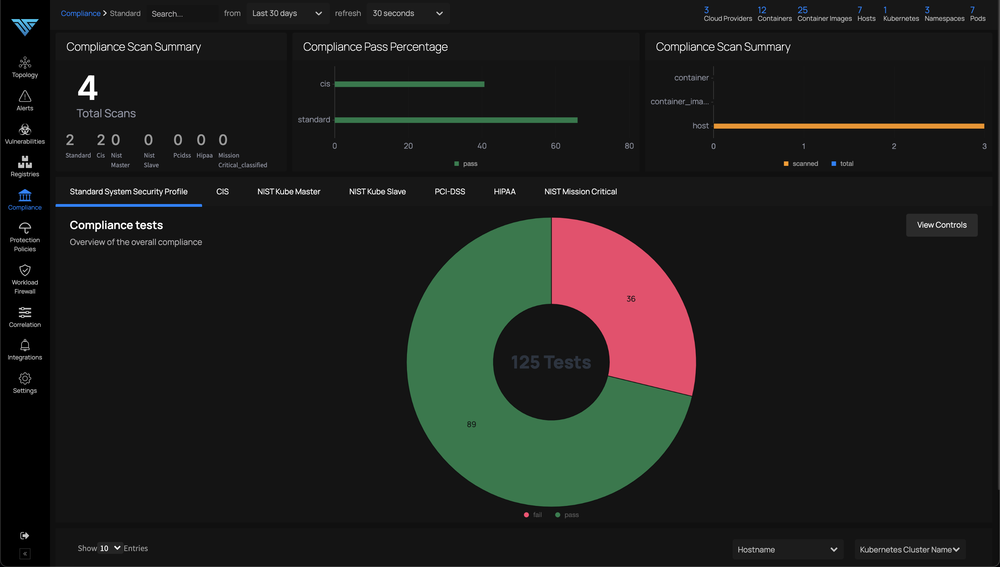
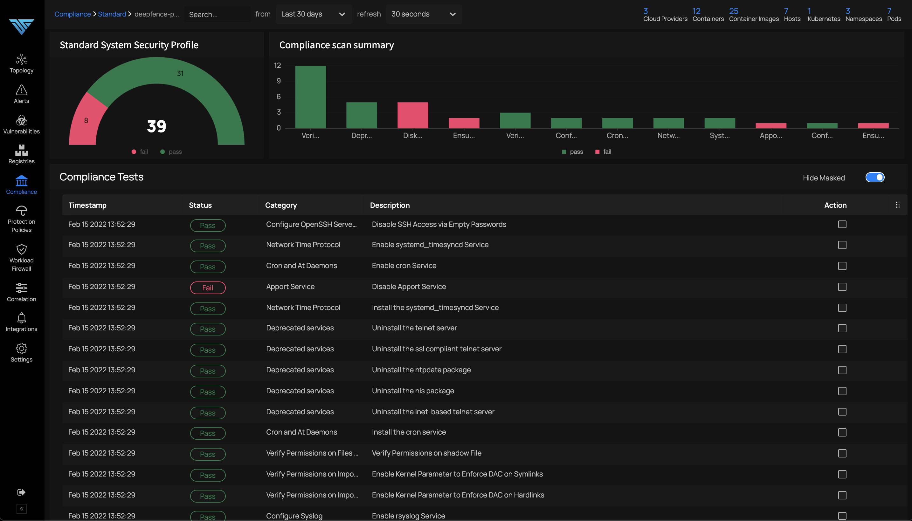

# Runtime Compliance

*Check runtime for compliance*

From the topology view, runtime compliance scanning for running containers & hosts can be initiated using the console dashboard, or by using APIs. Here is snapshot of runtime compliance scan on a host node.

The compliance status of each node can be viewed by navigating to Compliance menu as follows:

Clicking on each of the lines in the above image produces the details for each of the items as follows:

