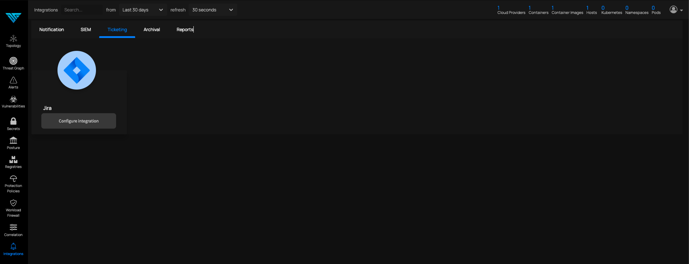
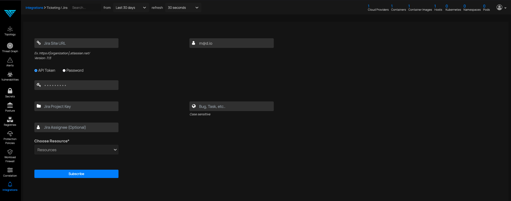
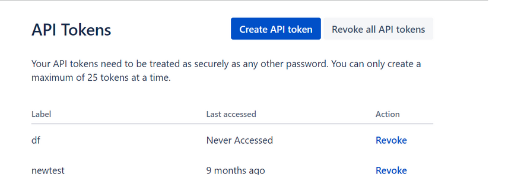
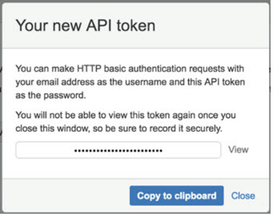

# JIRA

*Forward Notifications to JIRA*

### This feature will create a jira ticket with the scan and alert reports as its content

Step 1, navigate to the integrations page Ticketing-->Jira

Click on Configure Integration

You must see the following page

Here is an example of what should be filled in each field:

Jira site url: https://deepfence.atlassian.net/
Password: Jira password
Or  for API token:

1. Log in to https://id.atlassian.com/manage/api-tokens in a new tab
2. Click 'Create API token' as seen below:

3. From the dialog that appears, enter a memorable and concise 'Label' for your token and click 'Create.'
4. Copy the API token for example `wWE9ybhfL0TtlLyIBCSU32B4`
5. Use 'Copy to clipboard' and paste the token into the JIRA API token field on the JIRA account user page.

Click on view. Copy-paste the API token to API Token field
Jira project key: As an example consider that you have a ticket whose id is 
ENTERPRISE-1xx. Here ENTERPRISE is the project key. Paste that into Jira project key.

`Choose Resource: Select any scan, alert or log for which you need a jira ticket created. In this case let us choose Compliance Results.`

User name: To find the username of jira, open the comment section on any ticket and start typing the first two characters of the user prefixed with “@”. The text that follows is the username

User name: It is the email address with which you login to the Jira account.

Bug, Task etc: Type in Bug or Task etc. In this case, we type in Task.
Enter all the text and click subscribe. You must see `Integration added successfully`.
