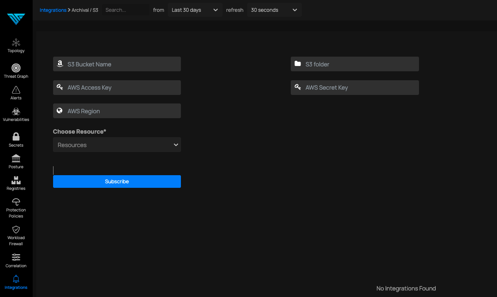

# S3

*Forward Notifications to S3*

### In This feature integration we will sending all information (selected resources ) to your Amazon s3 Bucket into selected folder [format of the file will be .json]

1. Type your S3 bucket name that bucket should be present in S3 Storage
2. Give any name for S3 folder name that will be created inside the Bucket if not present
3. Provide your Access Key and secret access key provided by amazon
4. Select your region in the next field
Choose your resources
5. Click subscribe button 

