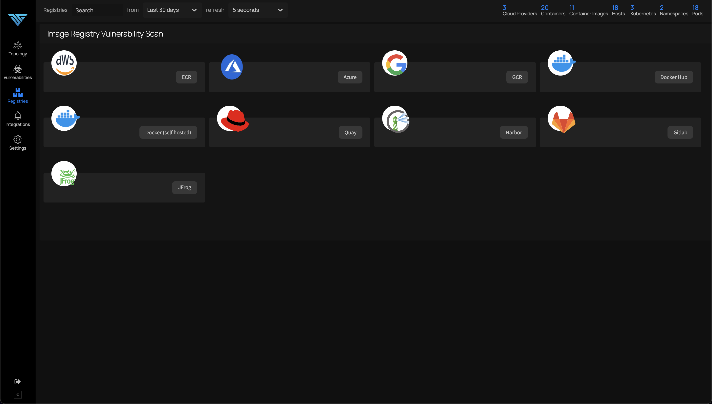

# Registry Scanning

*Scan registry images for issues*

You can scan for vulnerabilities in images stored in AWS ECR, Azure Container Registry, Google Cloud Container Registry, Docker Hub, Docker Self-Hosted Private Registry, Quay, Harbor, Gitlab and JFrog from the registry scanning dashboard. First, you will need to click the "Add registry" button and add the credentials to populate available images. After that you can select the images to scan and click the scan button as shown the image below:

