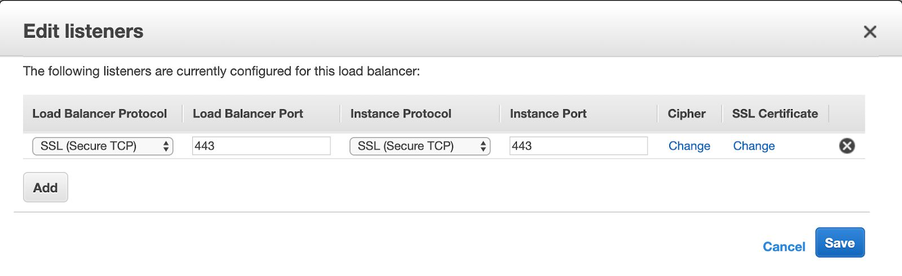

## Docker configuration in Amazon Linux / RHEL
In Amazon Linux / RHEL, number of open files per container has to be configured.

```shell
$ cat /etc/sysconfig/docker
# The max number of open files for the daemon itself, and all
# running containers. The default value of 1048576 mirrors the value
# used by the systemd service unit.
DAEMON_MAXFILES=1048576
# Additional startup options for the Docker daemon, for example:
# OPTIONS=” — ip-forward=true — iptables=true”
# By default we limit the number of open files per container
OPTIONS=" — default-ulimit nofile=1024:4096"
```
You can change the desired value as below.
```shell
OPTIONS=" — default-ulimit nofile=1024000:1024000"
```
Restart Docker daemon

## Reset Password

If you have not configured [SES / SMTP](manage-users.md#configuring-google-smtp) and need to reset the password, please follow these steps
- In docker
```shell
docker exec -it deepfence-api bash -c "flask reset-password"
```
- In kubernetes
```shell
kubectl exec -it deploy/deepfence-api -c deepfence-api -- bash -c "flask reset-password"
```

## Docker Restarts

If the Deepfence management console VM or host has been reset/rebooted, run a following commands on the VM or host that has the Deepfence management console to restart the services:

```
docker compose -f docker-compose.yml down
sudo sysctl -w vm.max_map_count=262144
docker compose -f docker-compose.yml up -d
```

## Agent Management

If agents need to be stopped:

 * In a kubernetes environment, execute the following command:

   ```
   helm delete deepfence-agent -n deepfence
   ```

 * Otherwise, for those hosts where we need to stop the deepfence agent, execute the following command on that host:

   ```
   docker rm -f deepfence-agent
   ```

## Using AWS Elastic Load Balancer

If the Deepfence management console is placed behind an AWS elastic load balancer, set the load balancer protocol as **SSL (Secure TCP)** instead of **HTTPS**:

