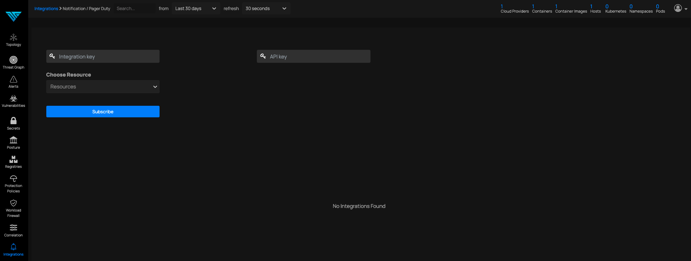
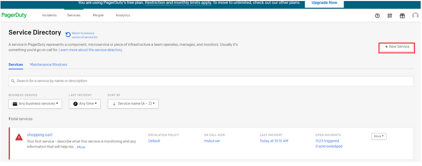
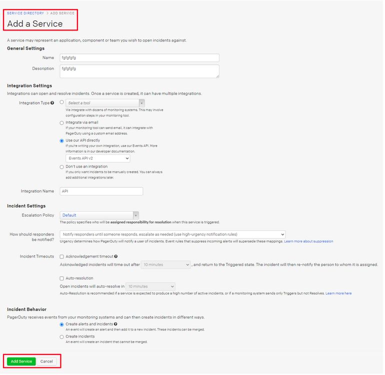
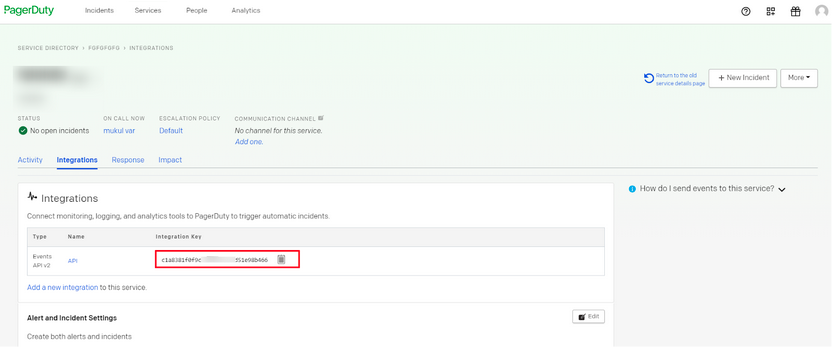

# PagerDuty

*Forward Notifications to PagerDuty*

### Steps To Setup PagerDuty :

1. Create Pagerduty Account 
2. Then services→+New Service

3. Fill the required fields and click on add new service.

4. Once we click on add new service the integration key will be generated as below

5. Use this generated key in our portal to complete the setting after choosing required resources.
6. After following the above steps our page should see integration added successfully

