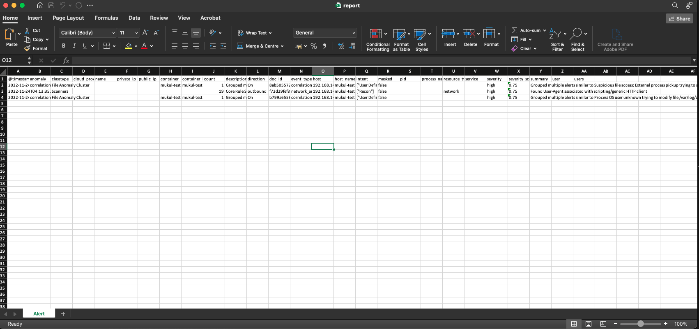

# XLSX and PDF

*Download Notifications in XLSX and PDF formats*

### In this feature you will be able to download the all reports generated in excel format

```Generating and Downloading Alerts XLSX```

1. Fill all required information in the below image


2. Click on the download link and we will be seeing a excel file getting downloaded

File will container following column
```
@timestamp	
anomaly	
classtype
cloud_provider	
name	
private_ip	
public_ip	
container_id	
container_image	
count	
description	
direction	
doc_id	
event_type	
host	
host_name	
intent	
masked	
pid	
process_name	
resource_type	
service	severity	
severity_score	
summary	user	
users
```



```Generating and Downloading Alerts PDF```

1. Fill all required information in the below image


2. Click on the download link and we will be seeing a PDF file getting downloaded

File will container following column

```
Time
Severity
Intent
ClassType
Summary
Link
```

```User will be seeing the report like below```


### Vulnerabillity 

```fields available in the XLSX report```
```
@timestamp	
cve_attack_vector	
cve_caused_by_package	
cve_container_image	
scan_id	
cve_container_image_id	
cve_cvss_score	
cve_description	
cve_fixed_in	
cve_id	
cve_link	
cve_severity	
cve_overall_score	
cve_type	
host	
host_name	
masked
```

```fields available in the PDF report```
```
Serial Number
CVE ID
Package
Severity
Summary
Link
```

```User will be seeing the report like below```


### Posture Scan 

```fields available in the XLSX report```
```
@timestamp	
compliance_check_type	
count	
doc_id	
host	
host_name	
masked	
node_id	
node_name	
node_type	
scan_id	
status	
test_category	
test_desc	
test_info	
test_number
```

```fields available in the PDF report```
```
Serial Number
Status
Category
Description
Link
```

```User will be seeing the report like below```


### Secret Scan 

```fields available in the XLSX report```
```
@timestamp	
cve_attack_vector	
cve_caused_by_package	
cve_container_image	
scan_id	
cve_container_image_id	
cve_cvss_score	
cve_description	
cve_fixed_in	
cve_id	
cve_link	
cve_severity	
cve_overall_score	
cve_type	
host	
host_name	
masked
```

```fields available in the PDF report```
```
Serial Number
Rule Name
File Name
Severity
Matched Content
Part
```

```User will be seeing the report like below```


