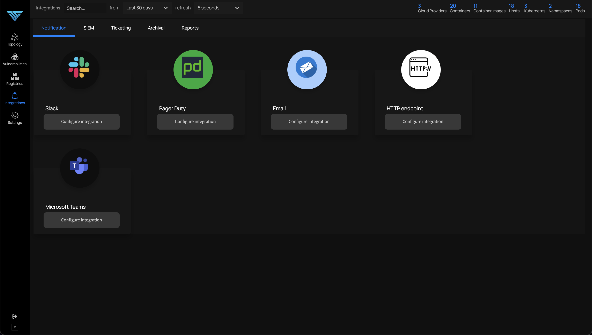

# Notifications

*Forward Notifications to External Services*

ThreatStryker logs and scanning reports can be routed to various SIEMs and notifications channels. Configure the routing from the Notifications screen.

For detailed instructions on integrations, refer to the corresponding appropriate documentation:

 * [Slack Integration](/docs/integrations/slack)
 * [Sumo Logic Integration](/docs/integrations/sumo-logic)
 * [Terraform Integration](/docs/integrations/terraform)
 * [Email Integration](/docs/integrations/email)
 * [HTTP Endpoint Integration](/docs/integrations/http-endpoint)
 * [Jira Integration](/docs/integrations/jira)
 * [PagerDuty Integration](/docs/integrations/pager-duty)
 * [S3 Integration](/docs/integrations/s3)
 * [XLSX and PDF Reports ](/docs/integrations/xlsx-pdf)

:::info
ThreatStryker and ThreatMapper behave identically with respect to integrations, although ThreatStryker can raise a much broader set of notifications and alerts.
:::

