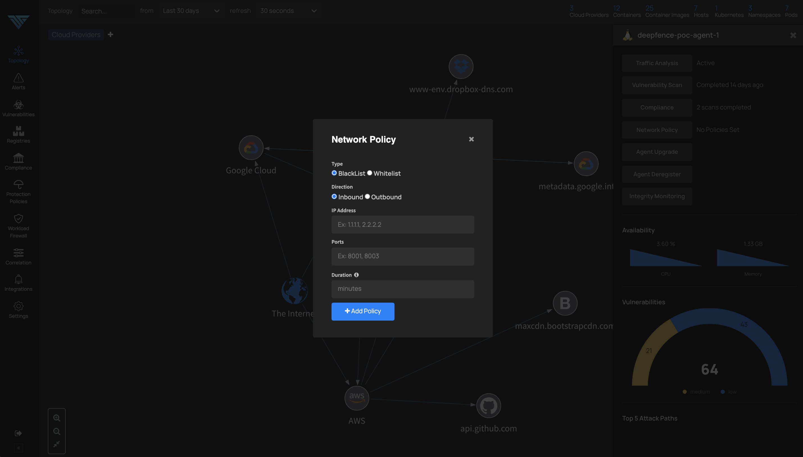
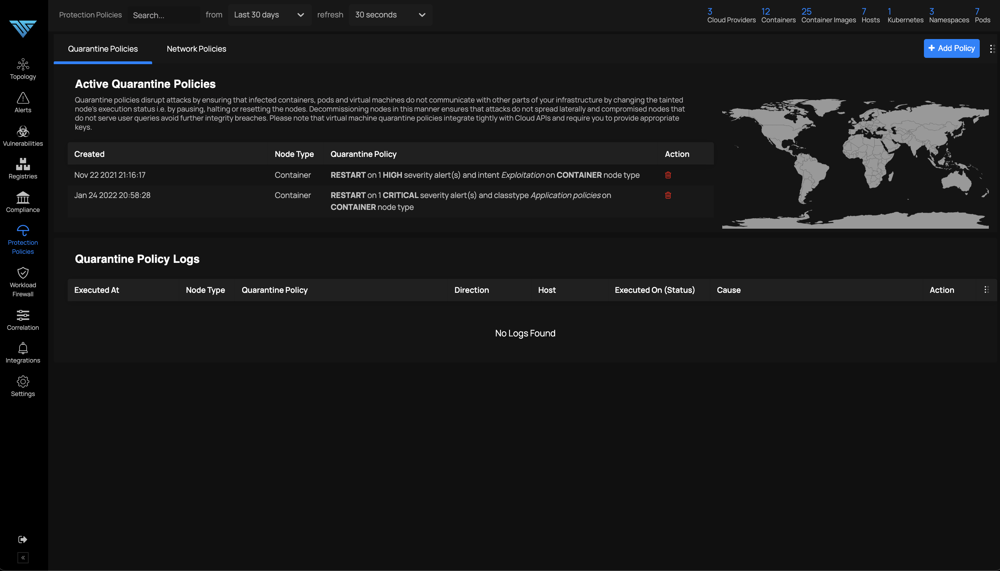

# Runtime Workload Firewall

*Define Access Control Policies for Workloads*

You can define workload specific allow-lists or deny-lists per workload at runtime using UI or by using runtime APIs. Deepfence currently supports addition of policies for containers, pods as well as virtual machines.

The blacklist (allow-list) and whitelist (deny-list) policies added to the system can be visualized and managed by visiting the **Policies** menu as follows:

